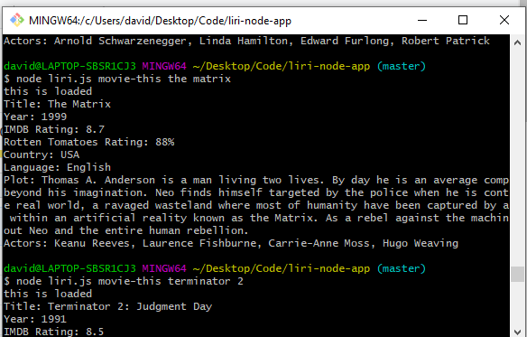
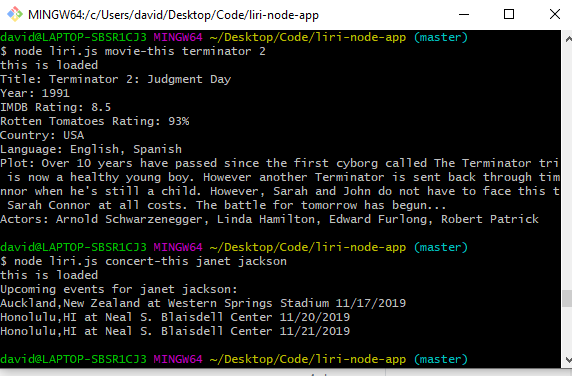
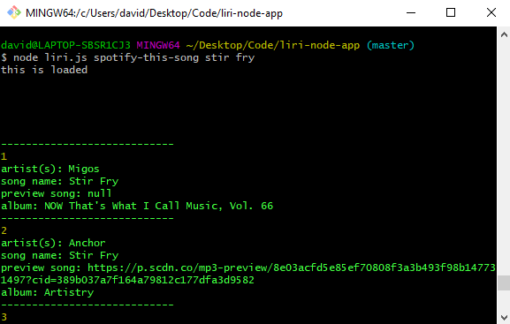
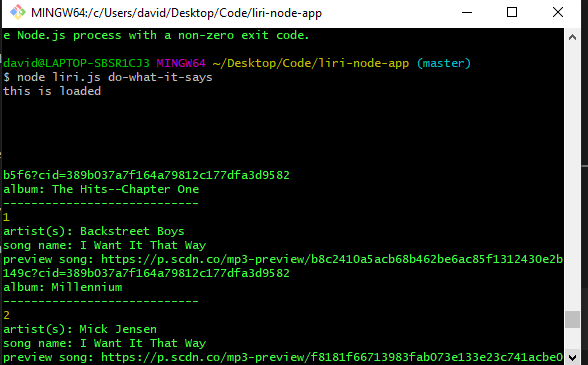
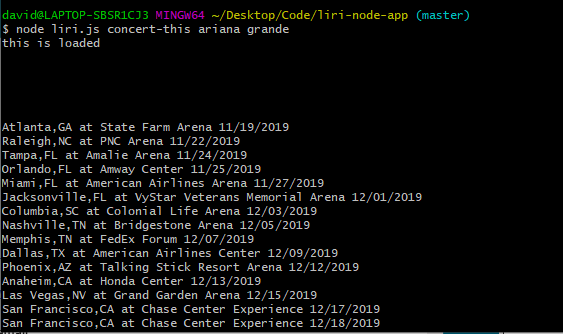
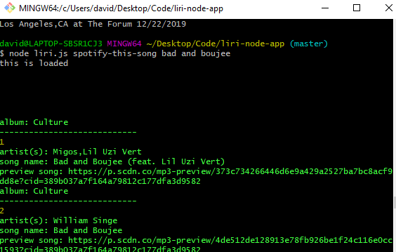

# liri-node-app

LIRI is an app that functions a lot like SIRI, but i'm using langauge instead of speech. Type input for a concert, movie or song and you will get information in return.

In order to get this to work you have to use dotenv, spotify, moment, axios and inquirer. Just clone the repo and type npm install in your terminal. You will need your own spotify client ID and secret key. Go to developer.spotify.com to get your api keys.

You can query songs, movies and concerts. I used bandsintown api for the concerts, OMDB API for movies and obviously spotify api for the songs.

In order to retrieve data, type node liri.js and any of the following commands, followed by your own query parameters:

concert-this

spotify-this-song

movie-this

do-what-it-says

A successful query should look like this:

node liri.js concert-this Migos

and there upcoming concert data will appear.

Check the images folder to see screenshots of the working app.

Thanks and have fun.

# Screenshots

